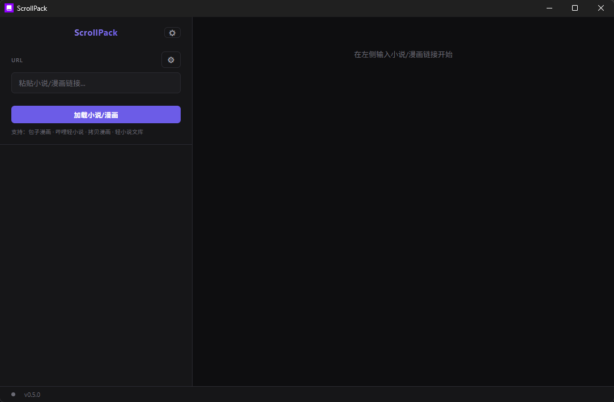

# ScrollPack


轻小说 / 漫画多源打包下载工具。输入作品链接，一键导出 EPUB 或 CBZ。




## 功能

- 多源支持：哔哩轻小说、轻小说文库、拷贝漫画、包子漫画、Mangabz
- 输出格式：EPUB（小说/漫画）、CBZ（漫画）
- 章节筛选、分卷合并、代理设置

## 下载

[Releases](https://github.com/EOEOY/ScrollPack/releases) 下载最新版本。解压后运行 `ScrollPack-v*-windows-x64.exe`，首次启动从插件仓库安装插件。

## 插件仓库

```
https://raw.githubusercontent.com/EOEOY/ScrollPack-plugins/master
```

## 开发插件

详见 [`ScrollPack-plugins` 开发教程](https://github.com/EOEOY/ScrollPack-plugins/blob/master/plugin_template/README.md)。继承 `BrowserSource`（漫画）或 `LightNovelSource`（小说），实现核心方法即可。

## 构建

```bash
pip install -r requirements.txt
pyinstaller ScrollPack.spec
```

## License

CC BY-NC 4.0 — 署名使用，禁止商用
